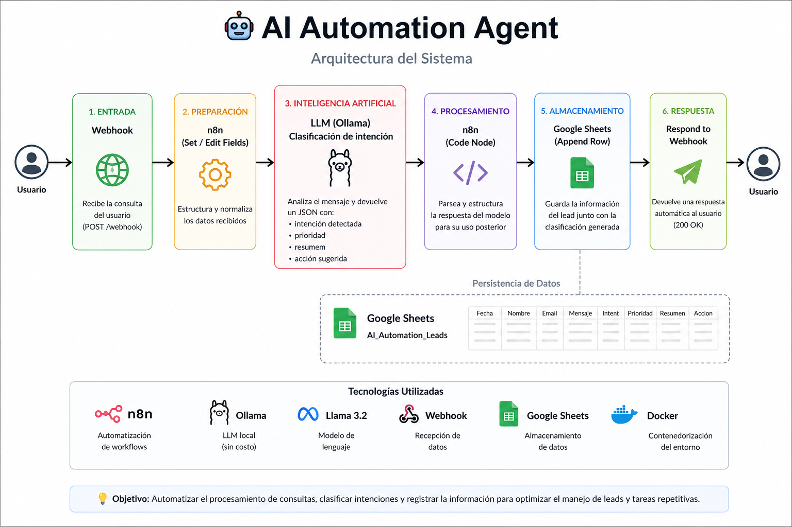

## 🤖 AI Automation Agent

**Proyecto real de AI Engineering usando n8n + LLM local (Ollama), sin dependencias de APIs pagas.**

Sistema de automatización con Inteligencia Artificial que procesa consultas utilizando modelos de inteligencia artificial (LLM), clasifica la intención y ejecuta acciones automáticamente.

---

## 🚀 ¿Qué hace este proyecto?

Este sistema permite:

- Recibir mensajes mediante Webhook
- Analizar el contenido con un modelo LLM local
- Clasificar la intención del usuario
- Estructurar la información en formato JSON
- Guardar los datos automáticamente
- Generar una respuesta automática

---
## ⚡ Demo rápida

Ejemplo de request:

```json
{
  "name": "Cliente Demo",
  "message": "Quiero automatizar respuestas a clientes"
}
```

Ejemplo de response:

```json
{
  "intent": "solicitud_automatizacion",
  "priority": "high"
}
```

---

## 💼 Caso de uso

Este sistema puede ser utilizado por empresas para:

- Clasificar automáticamente consultas de clientes
- Detectar oportunidades comerciales
- Automatizar respuestas iniciales
- Registrar leads en sistemas internos

Este proyecto automatiza todo ese flujo usando IA.

---

## ⚙️ Stack tecnológico

- **n8n** → Automatización de workflows  
- **Ollama** → LLM local (sin costo de API)  
- **Llama 3.2** → Modelo de lenguaje  
- **Webhooks** → Entrada de datos  
- **Google Sheets** → Persistencia de datos  
- **Docker** → Ejecución del entorno  

---

## 🏗️ Arquitectura



El sistema recibe una consulta, la procesa mediante un modelo LLM local utilizando Ollama, clasifica la intención y ejecuta acciones automáticas como almacenamiento y respuesta.

---

## 🔄 Flujo del sistema

```txt
Webhook → n8n → LLM (Ollama) → Clasificación → Base de datos → Respuesta automática
```

## 📌 Ejemplo de uso

Podés ver ejemplos completos en:
👉 /examples/sample-requests.md

## 🧩 Características principales

- Clasificación automática de intención
- Procesamiento de texto con IA
- Generación de respuestas automáticas
- Automatización de procesos
- Integración con APIs
- Sistema escalable

## 💡 ¿Por qué es interesante?

- Funciona sin APIs pagas
- Usa IA real (no mock)
- Automatiza un caso de uso real de negocio
- Representa un caso práctico de AI Engineering

## 📁 Estructura del proyecto

```txt
ai-automation-agent/
├── docs/
├── examples/
├── n8n/
├── prompts/
└── README.md
```

## 📈 Posibles mejoras

- Implementación de memoria (RAG)
- Integración con WhatsApp / Email
- Dashboard de visualización
- Migración a base de datos (MongoDB)

## 👨‍💻 Autor

**Alberto Arce**
AI Engineer | Backend Developer

## 🔗 Conectemos

- LinkedIn: https://linkedin.com/in/cucuarce
- GitHub: https://github.com/cucuarce